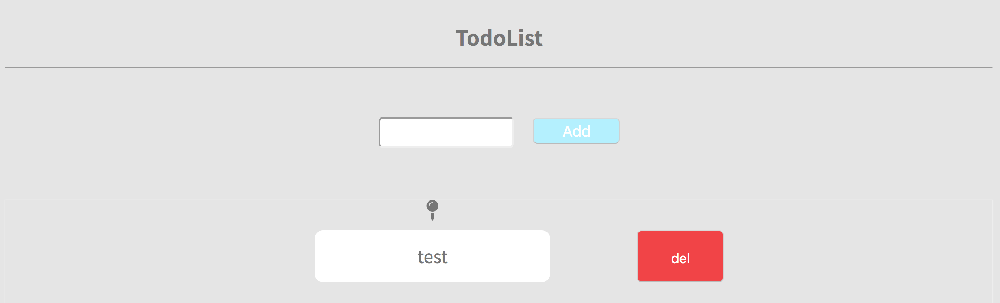

# Todoリスト

今回はJavaScriptの総復習としてTodoListをライブラリ無しでごりごり組みました。



実装のために必要なものは以下になります。

* Addボタンクリックでコメントアウトしてある下記コードをJavaScriptで動的に生成
* Delボタンクリックで対象要素を削除

シンプルな仕様ではありますが、それなりに歯応えはあるので既存のscript.jsを
差し替えてトライしてみるとよいかと思います。(´ω`)

```HTML
<ul class="todo-list__row">
	<li class="todo-list--item">
		<ul>
			<li><i class="fas fa-map-pin todo-list__pin"></i></li>
			<li class="todo-list__task">test</li>
		</ul>
	</li>
	<li>
		<button class="button--del" id="delButton-test">del</button>
	</li>
</ul>
```