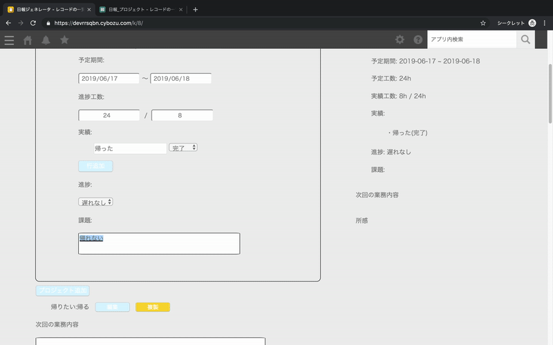

# 概要

Aipoの報告書っぽいやつをGUIでいい感じに作れる的なアプリを
kintoneで作りました。
利用した技術は以下のものです。

* Sass...スタイルに利用
* Vue.js...日報の入力値の保持及び一覧表示に利用
* Promise...kintoneのREST APIの非同期通信の制御に利用
* webpack...kintoneでES6をモジュールを扱うためのソースのバンドルで利用

## 機能概要

機能は現在以下のものができています。

* 日報の投稿機能
* 日報のプロジェクトを別アプリで管理する機能
* VueとカスタムビューでrecordのJSONから日報の一覧表示

## 動作デモ

